# 🔐 CONFIGURACIÓN CROSS-ACCOUNT - S3 DEL BANCO
## 📋 Guía Completa para Integración con S3 del Banco

---

## 🎯 DESCRIPCIÓN

Este documento detalla la configuración necesaria para que tu aplicación OCR SAM funcione **exclusivamente** con el S3 del banco, eliminando la necesidad de tu propio bucket S3. La aplicación se ejecuta en tu cuenta AWS pero accede a los datos almacenados en la cuenta del banco.

---

## 🏗️ ARQUITECTURA SIMPLIFICADA

```mermaid
graph TB
    subgraph "CUENTA DEL BANCO"
        A1[📁 S3 Bucket<br/>BANCO-BUCKET-NAME]
        A2[📁 incoming/<br/>PDFs depositados]
        A3[📁 oficios/<br/>Oficios separados]
        A4[📁 jobs/<br/>Resultados OCR]
        A5[📁 logs/<br/>Logs del sistema]
    end
    
    subgraph "TU CUENTA AWS"
        B1[🔄 S3 Document Processor<br/>Lambda Function]
        B2[🔄 Processor<br/>Lambda Function]
        B3[🏢 CRM Integrator<br/>Lambda Function]
        B4[📊 Batch Status<br/>Lambda Function]
        B5[🗃️ DynamoDB<br/>Tracking Table]
        B6[📬 SQS Queues<br/>Processing & CRM]
    end
    
    subgraph "SERVICIOS EXTERNOS"
        C1[🤖 Mistral AI<br/>OCR Processing]
        C2[🏢 Creatio CRM<br/>OData4 API]
    end
    
    A1 --> B1
    B1 --> B2
    B2 --> C1
    B2 --> A3
    B2 --> B6
    B6 --> B3
    B3 --> C2
    B3 --> B5
    B5 --> B4
```



---

## 🔧 CONFIGURACIÓN EN LA CUENTA DEL BANCO

### 1. **POLÍTICA IAM PARA TU APLICACIÓN**

El banco debe crear una política IAM que permita a tu aplicación acceder a su S3:

```json
{
  "Version": "2012-10-17",
  "Statement": [
    {
      "Sid": "AllowOCRAppFullAccess",
      "Effect": "Allow",
      "Principal": {
        "AWS": "arn:aws:iam::TU-ACCOUNT-ID:role/ocr-sam-project-dev-processor-role"
      },
      "Action": [
        "s3:GetObject",
        "s3:PutObject",
        "s3:DeleteObject",
        "s3:ListBucket",
        "s3:GetBucketLocation"
      ],
      "Resource": [
        "arn:aws:s3:::BANCO-BUCKET-NAME",
        "arn:aws:s3:::BANCO-BUCKET-NAME/*"
      ]
    }
  ]
}
```

### 2. **BUCKET POLICY EN EL S3 DEL BANCO**

Aplicar esta política directamente al bucket S3:

```json
{
  "Version": "2012-10-17",
  "Statement": [
    {
      "Sid": "AllowOCRAppCrossAccount",
      "Effect": "Allow",
      "Principal": {
        "AWS": "arn:aws:iam::TU-ACCOUNT-ID:role/ocr-sam-project-dev-processor-role"
      },
      "Action": [
        "s3:GetObject",
        "s3:PutObject",
        "s3:DeleteObject"
      ],
      "Resource": "arn:aws:s3:::BANCO-BUCKET-NAME/*"
    },
    {
      "Sid": "AllowOCRAppListBucket",
      "Effect": "Allow",
      "Principal": {
        "AWS": "arn:aws:iam::TU-ACCOUNT-ID:role/ocr-sam-project-dev-processor-role"
      },
      "Action": "s3:ListBucket",
      "Resource": "arn:aws:s3:::BANCO-BUCKET-NAME"
    }
  ]
}
```

### 3. **ESTRUCTURA DE CARPETAS EN EL S3 DEL BANCO**

El banco debe crear la siguiente estructura de carpetas:

```
BANCO-BUCKET-NAME/
├── incoming/                    # ← PDFs depositados por el banco
│   ├── documento_001.pdf
│   ├── documento_002.pdf
│   └── ...
├── oficios/                     # ← Oficios separados (creados por tu app)
│   └── lotes/
│       └── {batch_id}/
│           ├── {batch_id}_oficio_001.pdf
│           ├── {batch_id}_oficio_002.pdf
│           └── ...
├── jobs/                        # ← Resultados OCR (creados por tu app)
│   └── {job_id}/
│       ├── input.json
│       └── result.json
└── logs/                        # ← Logs del sistema (creados por tu app)
    └── {timestamp}/
        └── processing.log
```

---

## 🔧 CONFIGURACIÓN EN TU CUENTA AWS

### 1. **TEMPLATE.YAML ACTUALIZADO**

```yaml
AWSTemplateFormatVersion: '2010-09-09'
Transform: AWS::Serverless-2016-10-31
Description: 'OCR Legal Documents Processing System - Cross Account S3'

# =====================================
# PARÁMETROS
# =====================================
Parameters:
  Environment:
    Type: String
    Default: dev
    AllowedValues: [dev, staging, prod]
    
  MistralApiKey:
    Type: String
    NoEcho: true
    Description: Mistral API Key for OCR processing
  
  # NUEVOS PARÁMETROS PARA EL BANCO
  BancoS3BucketName:
    Type: String
    Default: "banco-ocr-documents"
    Description: S3 bucket del banco para documentos OCR
    
  BancoS3Region:
    Type: String
    Default: "us-east-1"
    Description: Región del S3 del banco
    
  CreatioUrl:
    Type: String
    Default: https://11006608-demo.creatio.com
    Description: Creatio CRM URL
    
  CreatioUsername:
    Type: String
    Default: Supervisor
    Description: Creatio CRM username
    
  CreatioPassword:
    Type: String
    NoEcho: true
    Default: "your-creatio-password-here"
    Description: Creatio CRM password
    
  EnableDynamoDB:
    Type: String
    Default: 'true'
    AllowedValues: ['true', 'false']
    Description: Enable DynamoDB tables for tracking

  SESFromEmail:
    Type: String
    Default: "edwin.penalba@cibernetica.net"
    Description: Email address for sending notifications
    
  SESReceiveEmail:
    Type: String
    Default: "oficios@cibernetica.xyz"  
    Description: Email address for receiving documents

  NotificationEnabled:
    Type: String
    Default: 'true'
    AllowedValues: ['true', 'false']
    Description: Enable email notifications

# =====================================
# GLOBALS
# =====================================
Globals:
  Function:
    Timeout: 900
    MemorySize: 512
    Runtime: python3.9
    Architectures: [x86_64]
    Environment:
      Variables:
        LOG_LEVEL: INFO
        BANCO_S3_BUCKET_NAME: !Ref BancoS3BucketName
        BANCO_S3_REGION: !Ref BancoS3Region
        MISTRAL_API_KEY: !Ref MistralApiKey
        SAVE_TO_DYNAMODB: !Ref EnableDynamoDB
        SES_FROM_EMAIL: !Ref SESFromEmail
        NOTIFICATION_ENABLED: !Ref NotificationEnabled

# =====================================
# CONDITIONS
# =====================================
Conditions:
  EnableDynamoDBCondition: !Equals [!Ref EnableDynamoDB, 'true']
  EnableNotificationsCondition: !Equals [!Ref NotificationEnabled, 'true']

# =====================================
# RESOURCES
# =====================================
Resources:

  # =====================================
  # DYNAMODB TABLES (MANTENER)
  # =====================================
  TrackingTable:
    Type: AWS::DynamoDB::Table
    Condition: EnableDynamoDBCondition
    Properties:
      TableName: !Sub "${AWS::StackName}-tracking"
      BillingMode: PAY_PER_REQUEST
      AttributeDefinitions:
        - AttributeName: batch_id
          AttributeType: S
        - AttributeName: oficio_id
          AttributeType: S
      KeySchema:
        - AttributeName: batch_id
          KeyType: HASH
        - AttributeName: oficio_id
          KeyType: RANGE
      TimeToLiveSpecification:
        AttributeName: ttl
        Enabled: true
      PointInTimeRecoverySpecification:
        PointInTimeRecoveryEnabled: true

  JobsTable:
    Type: AWS::DynamoDB::Table
    Condition: EnableDynamoDBCondition
    Properties:
      TableName: !Sub "${AWS::StackName}-jobs"
      BillingMode: PAY_PER_REQUEST
      AttributeDefinitions:
        - AttributeName: job_id
          AttributeType: S
      KeySchema:
        - AttributeName: job_id
          KeyType: HASH
      TimeToLiveSpecification:
        AttributeName: ttl
        Enabled: true
      PointInTimeRecoverySpecification:
        PointInTimeRecoveryEnabled: true

  # =====================================
  # API GATEWAY
  # =====================================
  OcrApi:
    Type: AWS::Serverless::Api
    Properties:
      Name: !Sub "${AWS::StackName}-ocr-api"
      StageName: !Ref Environment
      Cors:
        AllowMethods: "'GET,POST,OPTIONS'"
        AllowHeaders: "'Content-Type,X-Amz-Date,Authorization,X-Api-Key,X-Amz-Security-Token'"
        AllowOrigin: "'*'"
        MaxAge: "'600'"

  # =====================================
  # SQS QUEUES
  # =====================================
  ProcessingQueue:
    Type: AWS::SQS::Queue
    Properties:
      QueueName: !Sub "${AWS::StackName}-processing-queue"
      VisibilityTimeout: 960
      MessageRetentionPeriod: 1209600
      ReceiveMessageWaitTimeSeconds: 20
      RedrivePolicy:
        deadLetterTargetArn: !GetAtt DeadLetterQueue.Arn
        maxReceiveCount: 3

  CrmQueue:
    Type: AWS::SQS::Queue
    Properties:
      QueueName: !Sub "${AWS::StackName}-crm-queue"
      VisibilityTimeout: 300
      MessageRetentionPeriod: 1209600
      ReceiveMessageWaitTimeSeconds: 20
      RedrivePolicy:
        deadLetterTargetArn: !GetAtt DeadLetterQueue.Arn
        maxReceiveCount: 3

  DeadLetterQueue:
    Type: AWS::SQS::Queue
    Properties:
      QueueName: !Sub "${AWS::StackName}-dlq"
      MessageRetentionPeriod: 1209600

  # =====================================
  # SNS TOPIC PARA NOTIFICACIONES
  # =====================================
  EmailNotificationTopic:
    Type: AWS::SNS::Topic
    Condition: EnableNotificationsCondition
    Properties:
      DisplayName: "Email Processing Notifications"

  # =====================================
  # LAMBDA FUNCTIONS
  # =====================================
  
  # S3 DOCUMENT PROCESSOR FUNCTION (ACTUALIZADO)
  S3DocumentProcessorFunction:
    Type: AWS::Serverless::Function
    Properties:
      FunctionName: !Sub "${AWS::StackName}-s3-document-processor"
      CodeUri: src/s3_document_processor/
      Handler: app.lambda_handler
      MemorySize: 2048
      Timeout: 600
      Environment:
        Variables:
          BANCO_S3_BUCKET_NAME: !Ref BancoS3BucketName
          BANCO_S3_REGION: !Ref BancoS3Region
          OCR_QUEUE_URL: !Ref ProcessingQueue
          TRACKING_TABLE: !If [EnableDynamoDBCondition, !Ref TrackingTable, ""]
          SESFromEmail: !Ref SESFromEmail
          SESReceiveEmail: !Ref SESReceiveEmail
      Policies:
        # PERMISOS PARA EL BUCKET DEL BANCO
        - Statement:
          - Effect: Allow
            Action:
              - s3:GetObject
              - s3:PutObject
              - s3:DeleteObject
              - s3:ListBucket
            Resource:
              - !Sub "arn:aws:s3:::${BancoS3BucketName}"
              - !Sub "arn:aws:s3:::${BancoS3BucketName}/*"
        - SQSSendMessagePolicy:
            QueueName: !GetAtt ProcessingQueue.QueueName
        - !If
          - EnableDynamoDBCondition
          - DynamoDBCrudPolicy:
              TableName: !Ref TrackingTable
          - !Ref AWS::NoValue
        - Statement:
          - Effect: Allow
            Action:
              - ses:SendEmail
              - ses:SendRawEmail
            Resource: "*"
      Events:
        # NOTA: Este trigger debe ser configurado por el banco
        # ya que el S3 está en su cuenta
        S3DocumentEvent:
          Type: S3
          Properties:
            Bucket: !Ref BancoS3BucketName
            Events: s3:ObjectCreated:*
            Filter:
              S3Key:
                Rules:
                  - Name: prefix
                    Value: incoming/

  # PROCESSOR FUNCTION (ACTUALIZADO)
  ProcessorFunction:
    Type: AWS::Serverless::Function
    Properties:
      FunctionName: !Sub "${AWS::StackName}-processor"
      CodeUri: src/
      Handler: processor/app.lambda_handler
      MemorySize: 3008
      Timeout: 900
      ReservedConcurrentExecutions: 5
      Environment:
        Variables:
          BANCO_S3_BUCKET_NAME: !Ref BancoS3BucketName
          BANCO_S3_REGION: !Ref BancoS3Region
          CRM_QUEUE_URL: !Ref CrmQueue
          TRACKING_TABLE: !If [EnableDynamoDBCondition, !Ref TrackingTable, ""]
          JOBS_TABLE: !If [EnableDynamoDBCondition, !Ref JobsTable, ""]
      Policies:
        # PERMISOS PARA EL BUCKET DEL BANCO
        - Statement:
          - Effect: Allow
            Action:
              - s3:GetObject
              - s3:PutObject
              - s3:DeleteObject
              - s3:ListBucket
            Resource:
              - !Sub "arn:aws:s3:::${BancoS3BucketName}"
              - !Sub "arn:aws:s3:::${BancoS3BucketName}/*"
        - SQSPollerPolicy:
            QueueName: !GetAtt ProcessingQueue.QueueName
        - SQSSendMessagePolicy:
            QueueName: !GetAtt CrmQueue.QueueName
        - !If
          - EnableDynamoDBCondition
          - DynamoDBCrudPolicy:
              TableName: !Ref TrackingTable
          - !Ref AWS::NoValue
      Events:
        SQSEvent:
          Type: SQS
          Properties:
            Queue: !GetAtt ProcessingQueue.Arn
            BatchSize: 1

  # CRM INTEGRATOR FUNCTION (ACTUALIZADO)
  CrmIntegratorFunction:
    Type: AWS::Serverless::Function
    Properties:
      FunctionName: !Sub "${AWS::StackName}-crm-integrator"
      CodeUri: src/crm_integrator/
      Handler: app.lambda_handler
      MemorySize: 1024
      Timeout: 300
      Environment:
        Variables:
          BANCO_S3_BUCKET_NAME: !Ref BancoS3BucketName
          BANCO_S3_REGION: !Ref BancoS3Region
          TRACKING_TABLE: !If [EnableDynamoDBCondition, !Ref TrackingTable, ""]
          CREATIO_URL: !Ref CreatioUrl
          CREATIO_USERNAME: !Ref CreatioUsername
          CREATIO_PASSWORD: !Ref CreatioPassword
      Policies:
        # PERMISOS PARA EL BUCKET DEL BANCO
        - Statement:
          - Effect: Allow
            Action:
              - s3:GetObject
              - s3:PutObject
              - s3:DeleteObject
              - s3:ListBucket
            Resource:
              - !Sub "arn:aws:s3:::${BancoS3BucketName}"
              - !Sub "arn:aws:s3:::${BancoS3BucketName}/*"
        - SQSPollerPolicy:
            QueueName: !GetAtt CrmQueue.QueueName
        - !If
          - EnableDynamoDBCondition
          - DynamoDBCrudPolicy:
              TableName: !Ref TrackingTable
          - !Ref AWS::NoValue
      Events:
        CrmQueueEvent:
          Type: SQS
          Properties:
            Queue: !GetAtt CrmQueue.Arn
            BatchSize: 1

  # BATCH STATUS FUNCTION
  BatchStatusFunction:
    Type: AWS::Serverless::Function
    Properties:
      FunctionName: !Sub "${AWS::StackName}-batch-status"
      CodeUri: src/batch_status/
      Handler: app.lambda_handler
      MemorySize: 256
      Timeout: 30
      Environment:
        Variables:
          TRACKING_TABLE: !If [EnableDynamoDBCondition, !Ref TrackingTable, ""]
      Policies:
        - !If
          - EnableDynamoDBCondition
          - DynamoDBReadPolicy:
              TableName: !Ref TrackingTable
          - !Ref AWS::NoValue
      Events:
        ApiGetBatch:
          Type: Api
          Properties:
            RestApiId: !Ref OcrApi
            Path: /batch/status/{batch_id}
            Method: get

  # STATUS FUNCTION
  StatusFunction:
    Type: AWS::Serverless::Function
    Properties:
      FunctionName: !Sub "${AWS::StackName}-status"
      CodeUri: src/status/
      Handler: app.lambda_handler
      MemorySize: 256
      Timeout: 30
      Environment:
        Variables:
          BANCO_S3_BUCKET_NAME: !Ref BancoS3BucketName
          BANCO_S3_REGION: !Ref BancoS3Region
          TRACKING_TABLE: !If [EnableDynamoDBCondition, !Ref TrackingTable, ""]
      Policies:
        # PERMISOS PARA EL BUCKET DEL BANCO
        - Statement:
          - Effect: Allow
            Action:
              - s3:GetObject
              - s3:ListBucket
            Resource:
              - !Sub "arn:aws:s3:::${BancoS3BucketName}"
              - !Sub "arn:aws:s3:::${BancoS3BucketName}/*"
        - !If
          - EnableDynamoDBCondition
          - DynamoDBReadPolicy:
              TableName: !Ref TrackingTable
          - !Ref AWS::NoValue
      Events:
        ApiGet:
          Type: Api
          Properties:
            RestApiId: !Ref OcrApi
            Path: /document/status/{job_id}
            Method: get

  # NOTIFICATION FUNCTION
  NotificationFunction:
    Type: AWS::Serverless::Function
    Condition: EnableNotificationsCondition
    Properties:
      FunctionName: !Sub "${AWS::StackName}-notification"
      CodeUri: src/notification/
      Handler: app.lambda_handler
      MemorySize: 256
      Timeout: 60
      Environment:
        Variables:
          SES_FROM_EMAIL: !Ref SESFromEmail
      Policies:
        - Statement:
          - Effect: Allow
            Action:
              - ses:SendEmail
              - ses:SendRawEmail
            Resource: "*"
      Events:
        SNSEvent:
          Type: SNS
          Properties:
            Topic: !Ref EmailNotificationTopic

# =====================================
# OUTPUTS
# =====================================
Outputs:
  ApiGatewayUrl:
    Description: URL del API Gateway
    Value: !Sub "https://${OcrApi}.execute-api.${AWS::Region}.amazonaws.com/${Environment}"

  DocumentEndpoint:
    Description: Endpoint para procesar documentos
    Value: !Sub "https://${OcrApi}.execute-api.${AWS::Region}.amazonaws.com/${Environment}/document"

  StatusEndpoint:
    Description: Endpoint para consultar estado
    Value: !Sub "https://${OcrApi}.execute-api.${AWS::Region}.amazonaws.com/${Environment}/document/status/{job_id}"

  BatchStatusEndpoint:
    Description: Endpoint para consultar estado de lotes
    Value: !Sub "https://${OcrApi}.execute-api.${AWS::Region}.amazonaws.com/${Environment}/batch/status/{batch_id}"

  BancoS3BucketName:
    Description: Nombre del bucket S3 del banco
    Value: !Ref BancoS3BucketName

  BancoS3Region:
    Description: Región del bucket S3 del banco
    Value: !Ref BancoS3Region

  SESReceiveEmail:
    Description: Email para recepción de documentos
    Value: !Ref SESReceiveEmail

  SESFromEmail:
    Description: Email para envío de notificaciones
    Value: !Ref SESFromEmail
```

### 2. **SAMCONFIG.TOML ACTUALIZADO**

```toml
[default]
parameter_overrides = [
  "EnableDynamoDB=true",
  "BancoS3BucketName=banco-ocr-documents",
  "BancoS3Region=us-east-1",
  "CreatioUrl=https://11006608-demo.creatio.com",
  "CreatioUsername=Supervisor",
  "CreatioPassword=!k*ZPCT&MkuF2cDiM!S",
  "SESFromEmail=edwin.penalba@cibernetica.net",
  "SESReceiveEmail=oficios@cibernetica.xyz",
  "NotificationEnabled=true"
]
```

---

## 🔄 MODIFICACIONES EN EL CÓDIGO

### 1. **S3 Document Processor (Actualizado)**

```python
# src/s3_document_processor/app.py
import boto3
import os
import json
import uuid
import logging
from datetime import datetime

logger = logging.getLogger()
logger.setLevel(logging.INFO)

def lambda_handler(event, context):
    """
    Procesa documentos PDF depositados en el S3 del banco
    """
    try:
        # Configuración del bucket del banco
        banco_bucket = os.environ['BANCO_S3_BUCKET_NAME']
        banco_region = os.environ['BANCO_S3_REGION']
        
        # Cliente S3 para el bucket del banco
        s3_client = boto3.client('s3', region_name=banco_region)
        
        logger.info(f"Processing S3 event from banco bucket: {banco_bucket}")
        
        for record in event['Records']:
            bucket = record['s3']['bucket']['name']
            key = record['s3']['object']['key']
            
            # Verificar que el evento viene del bucket del banco
            if bucket == banco_bucket and key.startswith('incoming/'):
                logger.info(f"Processing document: {bucket}/{key}")
                process_document_from_banco_bucket(s3_client, bucket, key)
            else:
                logger.warning(f"Ignoring event from unexpected bucket/key: {bucket}/{key}")
                
    except Exception as e:
        logger.error(f"Error processing S3 event: {str(e)}")
        raise

def process_document_from_banco_bucket(s3_client, bucket, key):
    """
    Procesa un documento PDF desde el bucket del banco
    """
    try:
        # 1. Descargar PDF del bucket del banco
        logger.info(f"Downloading PDF from banco bucket: {bucket}/{key}")
        response = s3_client.get_object(Bucket=bucket, Key=key)
        pdf_content = response['Body'].read()
        
        # 2. Extraer configuración de la primera página
        config = extract_config_from_first_page(pdf_content)
        logger.info(f"Extracted config: {config}")
        
        # 3. Procesar PDF (división en oficios)
        batch_id = str(uuid.uuid4())
        oficios = split_pdf_into_oficios(pdf_content)
        
        # 4. Validar configuración
        validate_configuration(config, len(oficios))
        
        # 5. Crear registros en DynamoDB
        create_batch_tracking_record(batch_id, config, source="banco_s3")
        
        # 6. Guardar oficios en el bucket del banco
        save_oficios_to_banco_bucket(s3_client, bucket, batch_id, oficios)
        
        # 7. Enviar a cola de procesamiento
        send_oficios_to_processing_queue(oficios, batch_id, source="banco_s3")
        
        logger.info(f"Successfully processed document: {batch_id}")
        
    except Exception as e:
        logger.error(f"Error processing document from banco bucket: {str(e)}")
        raise

def save_oficios_to_banco_bucket(s3_client, bucket, batch_id, oficios):
    """
    Guarda los oficios separados en el bucket del banco
    """
    try:
        for i, oficio in enumerate(oficios):
            oficio_key = f"oficios/lotes/{batch_id}/{batch_id}_oficio_{i+1:03d}.pdf"
            
            s3_client.put_object(
                Bucket=bucket,
                Key=oficio_key,
                Body=oficio,
                ContentType='application/pdf',
                Metadata={
                    'batch_id': batch_id,
                    'oficio_number': str(i+1),
                    'source': 'banco_s3',
                    'created_at': datetime.utcnow().isoformat()
                }
            )
            
            logger.info(f"Saved oficio to banco bucket: {oficio_key}")
            
    except Exception as e:
        logger.error(f"Error saving oficios to banco bucket: {str(e)}")
        raise

def extract_config_from_first_page(pdf_content):
    """
    Extrae la configuración de la primera página del PDF
    """
    # Implementar extracción de configuración
    # Similar al código existente pero adaptado para el bucket del banco
    pass

def split_pdf_into_oficios(pdf_content):
    """
    Divide el PDF en oficios individuales
    """
    # Implementar división de PDF
    # Similar al código existente
    pass

def validate_configuration(config, actual_count):
    """
    Valida la configuración extraída
    """
    # Implementar validación
    pass

def create_batch_tracking_record(batch_id, config, source):
    """
    Crea registros de tracking en DynamoDB
    """
    # Implementar creación de registros
    pass

def send_oficios_to_processing_queue(oficios, batch_id, source):
    """
    Envía oficios a la cola de procesamiento
    """
    # Implementar envío a SQS
    pass
```

### 2. **Processor Function (Actualizado)**

```python
# src/processor/app.py
import boto3
import os
import json
import logging

logger = logging.getLogger()
logger.setLevel(logging.INFO)

def lambda_handler(event, context):
    """
    Procesa oficios individuales desde SQS
    """
    try:
        # Configuración del bucket del banco
        banco_bucket = os.environ['BANCO_S3_BUCKET_NAME']
        banco_region = os.environ['BANCO_S3_REGION']
        
        # Cliente S3 para el bucket del banco
        s3_client = boto3.client('s3', region_name=banco_region)
        
        for record in event['Records']:
            message_body = json.loads(record['body'])
            
            # Detectar tipo de procesamiento
            if 'oficio_data' in message_body or 's3_key' in message_body:
                # Procesamiento de oficio individual (banco S3)
                result = process_batch_oficio_job(message_body, context, s3_client, banco_bucket)
            else:
                # Job individual tradicional
                result = process_individual_ocr_job(message_body['job_id'], context, s3_client, banco_bucket)
                
    except Exception as e:
        logger.error(f"Error processing SQS message: {str(e)}")
        raise

def process_batch_oficio_job(message_body, context, s3_client, banco_bucket):
    """
    Procesa un oficio individual desde el bucket del banco
    """
    try:
        job_id = message_body['job_id']
        batch_id = message_body['batch_id']
        source = message_body.get('source', 'banco_s3')
        
        logger.info(f"Processing oficio job: {job_id} from {source}")
        
        # 1. Descargar PDF individual desde el bucket del banco
        s3_key = message_body['s3_key']
        response = s3_client.get_object(Bucket=banco_bucket, Key=s3_key)
        pdf_content = response['Body'].read()
        
        # 2. Extraer texto con OCR
        text_content = extract_text_with_ocr(pdf_content)
        
        # 3. Enviar a Mistral AI para análisis
        ocr_result = process_ocr_with_mistral(text_content)
        
        # 4. Guardar resultado en el bucket del banco
        save_ocr_result_to_banco_bucket(s3_client, banco_bucket, job_id, ocr_result)
        
        # 5. Enviar a cola CRM
        send_to_crm_queue(job_id, batch_id, source)
        
        logger.info(f"Successfully processed oficio job: {job_id}")
        
    except Exception as e:
        logger.error(f"Error processing oficio job: {str(e)}")
        raise

def save_ocr_result_to_banco_bucket(s3_client, banco_bucket, job_id, ocr_result):
    """
    Guarda el resultado OCR en el bucket del banco
    """
    try:
        # Guardar input.json
        input_key = f"jobs/{job_id}/input.json"
        s3_client.put_object(
            Bucket=banco_bucket,
            Key=input_key,
            Body=json.dumps(ocr_result['input'], indent=2),
            ContentType='application/json'
        )
        
        # Guardar result.json
        result_key = f"jobs/{job_id}/result.json"
        s3_client.put_object(
            Bucket=banco_bucket,
            Key=result_key,
            Body=json.dumps(ocr_result['result'], indent=2),
            ContentType='application/json'
        )
        
        logger.info(f"Saved OCR results to banco bucket: {result_key}")
        
    except Exception as e:
        logger.error(f"Error saving OCR results to banco bucket: {str(e)}")
        raise

def extract_text_with_ocr(pdf_content):
    """
    Extrae texto del PDF usando OCR
    """
    # Implementar extracción de texto
    pass

def process_ocr_with_mistral(text_content):
    """
    Procesa el texto con Mistral AI
    """
    # Implementar procesamiento con Mistral AI
    pass

def send_to_crm_queue(job_id, batch_id, source):
    """
    Envía a la cola CRM
    """
    # Implementar envío a SQS CRM
    pass
```

### 3. **CRM Integrator (Actualizado)**

```python
# src/crm_integrator/app.py
import boto3
import os
import json
import logging

logger = logging.getLogger()
logger.setLevel(logging.INFO)

def lambda_handler(event, context):
    """
    Integra resultados OCR con Creatio CRM
    """
    try:
        # Configuración del bucket del banco
        banco_bucket = os.environ['BANCO_S3_BUCKET_NAME']
        banco_region = os.environ['BANCO_S3_REGION']
        
        # Cliente S3 para el bucket del banco
        s3_client = boto3.client('s3', region_name=banco_region)
        
        for record in event['Records']:
            message_body = json.loads(record['body'])
            
            # Procesar integración CRM
            result = process_crm_integration(message_body, s3_client, banco_bucket)
            
    except Exception as e:
        logger.error(f"Error processing CRM integration: {str(e)}")
        raise

def process_crm_integration(message_body, s3_client, banco_bucket):
    """
    Procesa la integración con Creatio CRM
    """
    try:
        job_id = message_body['job_id']
        batch_id = message_body['batch_id']
        source = message_body.get('source', 'banco_s3')
        
        logger.info(f"Processing CRM integration for job: {job_id} from {source}")
        
        # 1. Leer resultado OCR desde el bucket del banco
        result_key = f"jobs/{job_id}/result.json"
        response = s3_client.get_object(Bucket=banco_bucket, Key=result_key)
        ocr_result = json.loads(response['Body'].read())
        
        # 2. Mapear datos al formato Creatio
        creatio_data = map_ocr_data_to_creatio(ocr_result)
        
        # 3. Autenticar con Creatio
        session = authenticate_with_creatio()
        
        # 4. Crear caso en Creatio
        case_id = create_creatio_case(session, creatio_data['case'])
        
        # 5. Crear registros de personas
        for person in creatio_data['persons']:
            create_creatio_person(session, person, case_id)
        
        # 6. Actualizar tracking en DynamoDB
        update_tracking_status(batch_id, job_id, "completed", case_id)
        
        logger.info(f"Successfully completed CRM integration for job: {job_id}")
        
    except Exception as e:
        logger.error(f"Error in CRM integration: {str(e)}")
        raise

def map_ocr_data_to_creatio(ocr_result):
    """
    Mapea los datos OCR al formato de Creatio
    """
    # Implementar mapeo de datos
    pass

def authenticate_with_creatio():
    """
    Autentica con Creatio CRM
    """
    # Implementar autenticación
    pass

def create_creatio_case(session, case_data):
    """
    Crea un caso en Creatio
    """
    # Implementar creación de caso
    pass

def create_creatio_person(session, person_data, case_id):
    """
    Crea un registro de persona en Creatio
    """
    # Implementar creación de persona
    pass

def update_tracking_status(batch_id, job_id, status, case_id):
    """
    Actualiza el estado en DynamoDB
    """
    # Implementar actualización de estado
    pass
```

---

## 📋 CHECKLIST DE IMPLEMENTACIÓN

### ✅ **EN LA CUENTA DEL BANCO:**
- [ ] Crear política IAM para tu rol de aplicación
- [ ] Aplicar bucket policy al S3 del banco
- [ ] Crear estructura de carpetas en el S3
- [ ] Configurar notificaciones S3 (opcional)
- [ ] Proporcionar ARN de tu rol a tu aplicación
- [ ] Configurar permisos de acceso cross-account

### ✅ **EN TU CUENTA AWS:**
- [ ] Actualizar template.yaml con parámetros del banco
- [ ] Modificar código para manejar cross-account access
- [ ] Configurar variables de entorno
- [ ] Desplegar stack actualizado
- [ ] Probar acceso al S3 del banco
- [ ] Configurar monitoreo y logging

### ✅ **CONFIGURACIÓN DE SEGURIDAD:**
- [ ] Usar roles IAM específicos (no usuarios)
- [ ] Aplicar principio de menor privilegio
- [ ] Configurar logging y monitoreo
- [ ] Implementar rotación de credenciales
- [ ] Configurar alertas de seguridad

---

## 🔍 MONITOREO Y LOGGING

### **CloudWatch Logs**
```python
# Agregar logging específico para cross-account
logger.info(f"Processing document from banco bucket: {bucket}/{key}")
logger.info(f"Cross-account access successful for batch: {batch_id}")
logger.info(f"Saved results to banco bucket: {result_key}")
```

### **Métricas Personalizadas**
```python
# Enviar métricas a CloudWatch
cloudwatch = boto3.client('cloudwatch')
cloudwatch.put_metric_data(
    Namespace='OCR/CrossAccount',
    MetricData=[
        {
            'MetricName': 'DocumentsProcessedFromBanco',
            'Value': 1,
            'Unit': 'Count'
        },
        {
            'MetricName': 'ProcessingTime',
            'Value': processing_time,
            'Unit': 'Seconds'
        }
    ]
)
```

### **Alertas Configuradas**
- Errores de acceso cross-account
- Tiempo de procesamiento excesivo
- Fallos en integración CRM
- Documentos no procesados

---

## 🚀 DESPLIEGUE

### **1. Preparar Configuración**
```bash
# Actualizar samconfig.toml con parámetros del banco
sam build
sam deploy --guided
```

### **2. Verificar Acceso**
```bash
# Probar acceso al S3 del banco
aws s3 ls s3://BANCO-BUCKET-NAME/incoming/ --region BANCO-REGION
```

### **3. Configurar Trigger S3**
El banco debe configurar el trigger S3 para que notifique a tu Lambda cuando se depositen archivos en la carpeta `incoming/`.

---

## 📞 SOPORTE Y MANTENIMIENTO

### **Contactos**
- **Desarrollador:** Edwin Peñalba
- **Email:** edwin.penalba@cibernetica.net
- **Proyecto:** OCR SAM Project - Cross Account

### **Documentación Relacionada**
- [DIAGRAMA_FLUJO_COMPLETO_S3.md](./DIAGRAMA_FLUJO_COMPLETO_S3.md)
- [FLUJO_DETALLADO.md](./FLUJO_DETALLADO.md)
- [README.md](./README.md)

---

## 🔒 CONSIDERACIONES DE SEGURIDAD

1. **Principio de Menor Privilegio**: Solo permisos necesarios para el bucket del banco
2. **Rotación de Credenciales**: Implementar rotación automática de roles
3. **Logging y Auditoría**: Registrar todas las operaciones cross-account
4. **Encriptación**: Usar KMS para datos sensibles si es necesario
5. **VPC Endpoints**: Considerar VPC endpoints para mayor seguridad
6. **Monitoreo**: Alertas en tiempo real para accesos no autorizados

---

*Documento generado automáticamente - Sistema OCR SAM v2.0 Cross-Account*
*Última actualización: 2025-01-03*
