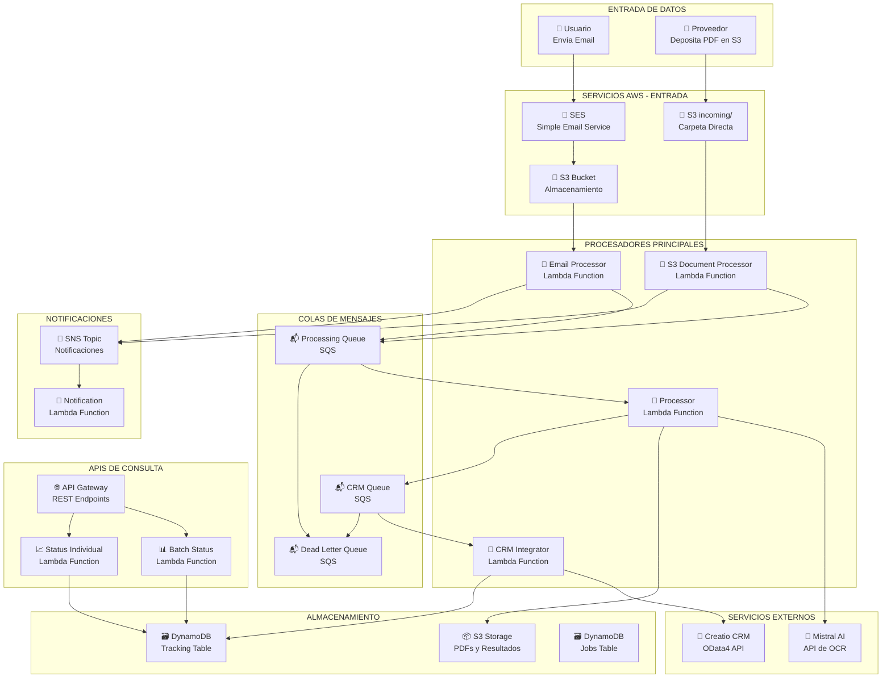

# 🔄 DIAGRAMA DE FLUJO COMPLETO - SISTEMA OCR SAM
## 📋 Flujo Detallado desde Trigger S3 hasta Integración CRM

---

## 🎯 DESCRIPCIÓN GENERAL

Este documento presenta el flujo completo del sistema OCR SAM, mostrando todos los pasos desde el trigger de S3 hasta la integración final con Creatio CRM. El sistema soporta dos flujos de entrada: **Email** y **S3 Directo**, ambos convergiendo en el mismo procesamiento OCR y CRM.

---

## 🏗️ ARQUITECTURA COMPLETA DEL SISTEMA



---

## 📋 FLUJO DETALLADO PASO A PASO

### 🎯 **FASE 1: ENTRADA DE DATOS**

#### **FLUJO A: EMAIL (EXISTENTE)**
```
👤 Usuario → 📧 Email → 📧 SES → 📁 S3 (emails/) → 🔄 Email Processor Lambda
```

**Paso 1.1: Recepción de Email**
- Usuario envía email a `oficios@cibernetica.xyz`
- Email contiene metadatos en el cuerpo:
  ```
  cantidad_oficios: 5
  empresa: Banco Global
  origen: Panamá
  observaciones: Oficios urgentes
  ```
- PDF adjunto con los oficios

**Paso 1.2: Procesamiento por SES**
- SES recibe email automáticamente
- Almacena email y PDF en S3: `s3://ocr-legal-documents-dev/emails/{email_id}/`
- Trigger ejecuta `EmailProcessorFunction`

#### **FLUJO B: S3 DIRECTO (NUEVO)**
```
🏢 Proveedor → 📁 S3 (incoming/) → 🔄 S3 Document Processor Lambda
```

**Paso 1.3: Depósito Directo en S3**
- Proveedor deposita PDF en `s3://ocr-legal-documents-dev/incoming/`
- PDF debe contener página de configuración en la primera página:
  ```
  ┌─────────────────────────────────────────────────────────┐
  │                    CONFIGURACIÓN DE LOTE                │
  │                                                         │
  │ cantidad_oficios: 50                                    │
  │ empresa: Banco Global                                   │
  │ origen: Chitre                                          │
  │ observaciones: Oficios urgentes                         │
  │                                                         │
  │ Fecha: 2025-01-03                                       │
  │ Operador: edwinpeñalba                                  │
  └─────────────────────────────────────────────────────────┘
  ```
- Trigger ejecuta `S3DocumentProcessorFunction`

---

### 🎯 **FASE 2: PROCESAMIENTO INICIAL**

#### **Email Processor (Flujo A)**
```python
# src/email_processor/app.py
def lambda_handler(event, context):
    # 1. Extraer metadatos del email con regex
    metadata = extract_email_body_data(email_body)
    
    # 2. Descargar PDF desde S3
    pdf_content = download_pdf_from_s3(bucket, key)
    
    # 3. Dividir PDF en oficios individuales
    oficios = split_pdf_into_oficios(pdf_content)
    
    # 4. Validar cantidad declarada vs extraída
    validate_oficios_count(declared_count, actual_count)
    
    # 5. Crear registros en DynamoDB
    create_batch_tracking_record(batch_id, metadata, source="email")
    
    # 6. Enviar oficios a cola de procesamiento
    send_oficios_to_processing_queue(oficios)
```

#### **S3 Document Processor (Flujo B)**
```python
# src/s3_document_processor/app.py
def lambda_handler(event, context):
    # 1. Procesar evento S3
    bucket, key = process_s3_event(event)
    
    # 2. Descargar PDF desde S3
    pdf_content = download_pdf_from_s3(bucket, key)
    
    # 3. Extraer configuración de primera página
    config = extract_config_from_first_page(pdf_content)
    
    # 4. Dividir PDF en oficios individuales (por página)
    oficios = split_pdf_into_oficios(pdf_content)
    
    # 5. Validar configuración
    validate_configuration(config, len(oficios))
    
    # 6. Crear registros en DynamoDB
    create_batch_tracking_record(batch_id, config, source="s3_direct")
    
    # 7. Enviar oficios a cola de procesamiento
    send_oficios_to_processing_queue(oficios)
```

**Resultado de Fase 2:**
- PDF original almacenado en S3
- Oficios individuales separados: `oficios/lotes/{batch_id}/{batch_id}_oficio_001.pdf`
- Registros creados en DynamoDB con `source: "email"` o `"s3_direct"`
- Mensajes enviados a `ProcessingQueue`

---

### 🎯 **FASE 3: PROCESAMIENTO OCR**

#### **Processor Lambda (Compartido)**
```python
# src/processor/app.py
def lambda_handler(event, context):
    for record in event['Records']:
        message_body = json.loads(record['body'])
        
        # Detectar tipo de procesamiento
        if 'oficio_data' in message_body or 's3_key' in message_body:
            # Procesamiento de oficio individual (email o S3)
            result = process_batch_oficio_job(message_body, context)
        else:
            # Job individual tradicional
            result = process_individual_ocr_job(job_id, context)
```

**Paso 3.1: Descarga y OCR**
```python
def process_batch_oficio_job(message_body, context):
    # 1. Extraer datos del mensaje
    job_id = message_body['job_id']
    batch_id = message_body['batch_id']
    source = message_body.get('source', 'email')
    
    # 2. Descargar PDF individual desde S3
    pdf_content = download_pdf_from_s3(bucket, s3_key)
    
    # 3. Extraer texto con OCR
    text_content = extract_text_with_ocr(pdf_content)
    
    # 4. Enviar a Mistral AI para análisis
    ocr_result = process_ocr_with_mistral(text_content)
    
    # 5. Guardar resultado en S3
    save_ocr_result_to_s3(job_id, ocr_result)
    
    # 6. Enviar a cola CRM
    send_to_crm_queue(job_id, batch_id, source)
```

**Paso 3.2: Integración con Mistral AI**
```python
def process_ocr_with_mistral(text_content):
    prompt = f"""
    Analiza el siguiente texto de un oficio legal y extrae la información estructurada:
    
    {text_content}
    
    Extrae:
    1. Información del oficio (número, autoridad, cliente, monto)
    2. Lista de personas con sus datos (nombre, identificación, monto, expediente)
    
    Responde en formato JSON válido.
    """
    
    response = mistral_client.chat.completions.create(
        model="mistral-large-latest",
        messages=[{"role": "user", "content": prompt}]
    )
    
    return parse_ocr_response(response.choices[0].message.content)
```

**Resultado OCR:**
```json
{
  "success": true,
  "data": {
    "informacion_extraida": {
      "numero_oficio": "2024-001",
      "autoridad": "Juzgado Civil",
      "oficiado_cliente": "Juan Pérez",
      "monto": "B/. 15,000.00"
    },
    "lista_personas": {
      "total_personas": 2,
      "monto_total": 15000.00,
      "listado": [
        {
          "secuencia": 1,
          "nombre_completo": "María García López",
          "identificacion": "8-123-456",
          "monto_numerico": 7500.00,
          "expediente": "EXP-2024-001"
        }
      ]
    }
  }
}
```

---

### 🎯 **FASE 4: INTEGRACIÓN CRM**

#### **CRM Integrator Lambda**
```python
# src/crm_integrator/app.py
def lambda_handler(event, context):
    for record in event['Records']:
        message_body = json.loads(record['body'])
        
        # 1. Leer resultado OCR desde S3
        ocr_result = read_ocr_result_from_s3(job_id)
        
        # 2. Mapear datos al formato Creatio
        creatio_data = map_ocr_data_to_creatio(ocr_result)
        
        # 3. Autenticar con Creatio
        session = authenticate_with_creatio()
        
        # 4. Crear caso en Creatio
        case_id = create_creatio_case(session, creatio_data['case'])
        
        # 5. Crear registros de personas
        for person in creatio_data['persons']:
            create_creatio_person(session, person, case_id)
        
        # 6. Actualizar tracking en DynamoDB
        update_tracking_status(batch_id, oficio_id, "completed", case_id)
```

**Paso 4.1: Mapeo de Datos**
```python
def map_ocr_data_to_creatio(ocr_result):
    case_data = {
        "Subject": f"Oficio: {ocr_result['numero_oficio']} - {ocr_result['autoridad']}",
        "Notes": f"Oficio procesado automáticamente por OCR\nCliente: {ocr_result['oficiado_cliente']}\nMonto: {ocr_result['monto']}",
        "PriorityId": "d9bd322c-f46b-1410-ee8c-0050ba5d6c38"
    }
    
    persons_data = []
    for person in ocr_result['lista_personas']['listado']:
        person_data = {
            "NdosNombre": person['nombre_completo'].split()[0],
            "NdosApellidoPaterno": person['nombre_completo'].split()[1] if len(person['nombre_completo'].split()) > 1 else "",
            "NdosApellidoMaterno": person['nombre_completo'].split()[2] if len(person['nombre_completo'].split()) > 2 else "",
            "NdosIdentificacionNumero": person['identificacion'],
            "NdosImporte": person['monto_numerico'],
            "NdosExpediente": person['expediente']
        }
        persons_data.append(person_data)
    
    return {"case": case_data, "persons": persons_data}
```

**Paso 4.2: Integración con Creatio**
```python
def create_creatio_case(session, case_data):
    url = f"{CREATIO_URL}/0/odata/Activity"
    response = session.post(url, json=case_data)
    
    if response.status_code == 201:
        return response.json()['Id']
    else:
        raise Exception(f"Error creating case: {response.text}")

def create_creatio_person(session, person_data, case_id):
    person_data['NdosOficioId'] = case_id
    url = f"{CREATIO_URL}/0/odata/NdosPersonasOCR"
    response = session.post(url, json=person_data)
    
    if response.status_code != 201:
        raise Exception(f"Error creating person: {response.text}")
```

---

### 🎯 **FASE 5: SEGUIMIENTO Y CONSULTAS**

#### **API Endpoints**

**1. Estado del Lote**
```http
GET /batch/status/{batch_id}
```

**Respuesta:**
```json
{
  "batch_id": "a2761de8-e5be-4ca9-a9db-abb166ac7a63",
  "status": "completed",
  "total_oficios": 5,
  "completed_oficios": 5,
  "failed_oficios": 0,
  "completion_rate": 100.0,
  "created_at": "2025-07-23T22:03:08.628954",
  "completed_at": "2025-07-23T22:04:36.649",
  "source": "s3_direct",
  "oficios": [
    {
      "oficio_id": "a2761de8-e5be-4ca9-a9db-abb166ac7a63_oficio_001",
      "sequence_number": 1,
      "status": "completed",
      "ocr_status": "completed",
      "crm_status": "completed",
      "crm_id": "case-12345",
      "created_at": "2025-07-23T22:03:08.628954",
      "completed_at": "2025-07-23T22:04:17.649"
    }
  ]
}
```

**2. Estado Individual**
```http
GET /document/status/{job_id}
```

**Respuesta:**
```json
{
  "job_id": "a2761de8-e5be-4ca9-a9db-abb166ac7a63_oficio_001",
  "status": "completed",
  "ocr_status": "completed",
  "crm_status": "completed",
  "crm_id": "case-12345",
  "created_at": "2025-07-23T22:03:08.628954",
  "completed_at": "2025-07-23T22:04:17.649",
  "error_message": null
}
```

---

## 🗄️ ESTRUCTURA DE DATOS

### 📦 **S3 BUCKET STRUCTURE**
```
ocr-legal-documents-dev/
├── incoming/                    # ← NUEVA CARPETA (S3 Directo)
│   ├── documento_001.pdf       # ← PDF depositado por proveedor
│   ├── documento_002.pdf       # ← PDF depositado por proveedor
│   └── ...
├── emails/                      # ← MANTENER (Flujo Email)
│   └── {email_id}/
│       ├── email.json
│       └── attachments/
├── oficios/
│   └── lotes/
│       └── {batch_id}/
│           ├── {batch_id}_oficio_001.pdf
│           ├── {batch_id}_oficio_002.pdf
│           └── ...
└── jobs/
    └── {job_id}/
        ├── input.json
        └── result.json
```

### 🗃️ **DYNAMODB SCHEMA**

**Tracking Table:**
```json
{
  "batch_id": "string (Partition Key)",
  "oficio_id": "string (Sort Key)",
  "status": "pending|processing|completed|error",
  "ocr_status": "pending|processing|completed|error",
  "crm_status": "pending|processing|completed|error",
  "sequence_number": "number",
  "created_at": "ISO timestamp",
  "updated_at": "ISO timestamp",
  "completed_at": "ISO timestamp",
  "crm_id": "string",
  "crm_details": "string",
  "error_message": "string",
  "source": "email|s3_direct"  // ← NUEVO CAMPO
}
```

**Jobs Table:**
```json
{
  "job_id": "string (Partition Key)",
  "status": "pending|processing|completed|error",
  "batch_id": "string",
  "oficio_id": "string",
  "created_at": "ISO timestamp",
  "updated_at": "ISO timestamp",
  "retry_count": "number",
  "error_message": "string"
}
```

---

## 🔧 COMPONENTES TÉCNICOS

### 📧 **Email Processor Function**
- **Archivo:** `src/email_processor/app.py`
- **Trigger:** S3 Object Created (carpeta `emails/`)
- **Memoria:** 2048 MB
- **Timeout:** 600 segundos
- **Función:** Procesa emails entrantes con PDFs adjuntos

### 📁 **S3 Document Processor Function**
- **Archivo:** `src/s3_document_processor/app.py`
- **Trigger:** S3 Object Created (carpeta `incoming/`)
- **Memoria:** 2048 MB
- **Timeout:** 600 segundos
- **Función:** Procesa documentos depositados directamente en S3

### 🔄 **Processor Function**
- **Archivo:** `src/processor/app.py`
- **Trigger:** SQS Message
- **Memoria:** 3008 MB
- **Timeout:** 900 segundos
- **Función:** Procesa OCR individual (email y S3 directo)

### 🏢 **CRM Integrator Function**
- **Archivo:** `src/crm_integrator/app.py`
- **Trigger:** SQS Message
- **Memoria:** 1024 MB
- **Timeout:** 300 segundos
- **Función:** Integra con Creatio CRM

### 📊 **Batch Status Function**
- **Archivo:** `src/batch_status/app.py`
- **Trigger:** API Gateway
- **Memoria:** 256 MB
- **Timeout:** 30 segundos
- **Función:** Consulta estado de lotes

### 📈 **Status Function**
- **Archivo:** `src/status/app.py`
- **Trigger:** API Gateway
- **Memoria:** 256 MB
- **Timeout:** 30 segundos
- **Función:** Consulta estado individual

---

## 🚀 CONFIGURACIÓN Y DESPLIEGUE

### 📄 **Template.yaml**
Define todos los recursos AWS:
- **Lambdas:** 6 funciones serverless
- **SQS:** 3 colas de mensajes
- **S3:** Bucket con triggers para ambas carpetas
- **DynamoDB:** 2 tablas para tracking
- **API Gateway:** Endpoints REST
- **SNS:** Topic para notificaciones

### 📄 **Samconfig.toml**
```toml
[default]
parameter_overrides = [
  "EnableDynamoDB=true",
  "S3BucketName=ocr-legal-documents-dev",
  "CreatioUrl=https://11006608-demo.creatio.com",
  "CreatioUsername=Supervisor",
  "CreatioPassword=!k*ZPCT&MkuF2cDiM!S"
]
```

---

## 🎯 BENEFICIOS DEL SISTEMA

### ✅ **AUTOMATIZACIÓN COMPLETA**
- Procesamiento automático desde entrada hasta CRM
- Sin intervención manual requerida
- Flujo end-to-end automatizado

### 📈 **ESCALABILIDAD**
- Arquitectura serverless
- Escala automáticamente según demanda
- Soporte para múltiples fuentes de entrada

### 🔍 **INTELIGENCIA ARTIFICIAL**
- OCR avanzado con Mistral AI
- Extracción inteligente de información
- Análisis contextual de documentos

### 📊 **SEGUIMIENTO EN TIEMPO REAL**
- Estado detallado de cada oficio
- API REST para consultas
- Diferenciación por fuente (email vs S3 directo)

### 🛡️ **CONFIABILIDAD**
- Reintentos automáticos
- Manejo robusto de errores
- Dead Letter Queue para mensajes fallidos

### 🔗 **INTEGRACIÓN CRM**
- Conexión directa con Creatio
- API OData4 estándar
- Mapeo automático de datos

---

## 🔄 FLUJO DE INTEGRACIÓN RESUMIDO

### 📧 **FLUJO EMAIL (EXISTENTE)**
```
Email → SES → S3 (emails/) → EmailProcessor → PDF Split → SQS → Processor → OCR → CRM
```

### 📁 **FLUJO S3 DIRECTO (NUEVO)**
```
Proveedor → S3 (incoming/) → S3DocumentProcessor → PDF Split → SQS → Processor → OCR → CRM
```

### 🔄 **FLUJO COMPARTIDO**
```
SQS → Processor → Mistral AI → S3 Results → SQS CRM → CRM Integrator → Creatio → DynamoDB
```

---

## 📞 SOPORTE Y MONITOREO

### 🔍 **CloudWatch Logs**
- `/aws/lambda/ocr-sam-project-dev-s3-document-processor`
- `/aws/lambda/ocr-sam-project-dev-processor`
- `/aws/lambda/ocr-sam-project-dev-crm-integrator`

### 📊 **Métricas Disponibles**
- Procesamiento por fuente (email vs S3 directo)
- Tiempos de procesamiento
- Tasa de éxito por flujo
- Errores por tipo y fuente

### 🚨 **Alertas**
- Errores de procesamiento
- Tiempo de procesamiento excesivo
- Fallos en integración CRM
- Mensajes en Dead Letter Queue

---

## 📝 NOTAS DE IMPLEMENTACIÓN

### 🔧 **CAMBIOS REALIZADOS**
1. **Nueva Lambda:** `S3DocumentProcessor`
2. **Template actualizado:** `template.yaml`
3. **Processor modificado:** Soporte para S3 directo
4. **Tracking mejorado:** Campo `source` para identificar origen

### ✅ **COMPATIBILIDAD**
- **Flujo Email:** ✅ Mantiene funcionalidad completa
- **Flujo S3 Directo:** ✅ Nueva funcionalidad
- **APIs existentes:** ✅ Sin cambios
- **Tracking:** ✅ Mejorado con campo source

### 🚀 **DESPLIEGUE**
El nuevo flujo se despliega automáticamente con el stack existente. No requiere cambios en la infraestructura actual, solo agrega la nueva lambda y configuración.

---

*Documento generado automáticamente - Sistema OCR SAM v2.0*
*Última actualización: 2025-01-03*
